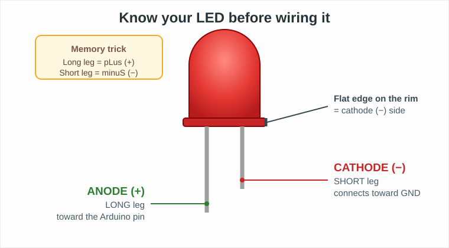
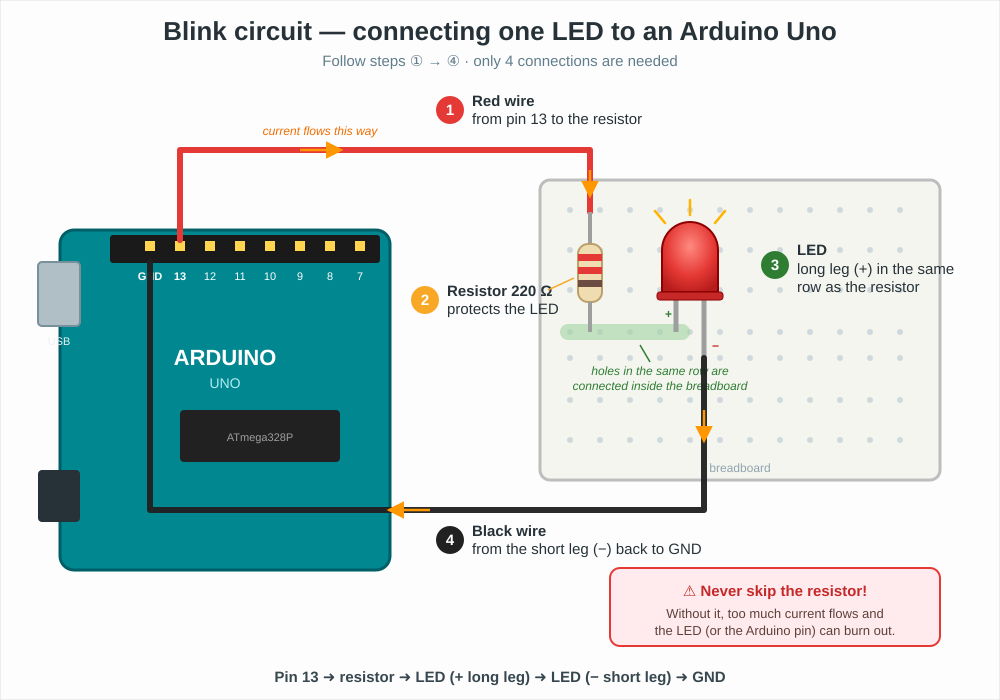

# Visual Guide: Connecting an LED to an Arduino (for Absolute Beginners)

This short hands-on extra explains, **visually and step by step**, how to safely connect an LED to an Arduino board and make it blink. No prior electronics experience is needed.

## What you will need

| Part | Quantity | Notes |
|------|----------|-------|
| Arduino Uno (or compatible) | 1 | Any board with digital pins works |
| LED (any color) | 1 | 5 mm standard LED |
| Resistor **220 Ω** | 1 | Color bands: red–red–brown (anything from 220 Ω to 1 kΩ is fine) |
| Breadboard | 1 | Small one is enough |
| Jumper wires | 2 | One red, one black (colors are a convention, not a requirement) |
| USB cable | 1 | To power the board and upload code |

## Step 1 — Know your LED

An LED only lets current flow in **one direction**. If you plug it in backwards it simply won't light up (it won't be damaged at low voltage — just flip it around).



Three ways to find the **+** side:

1. The **longer leg** is the anode (+).
2. The **flat edge** on the plastic rim marks the cathode (−).
3. Inside the bulb, the **smaller metal piece** is the anode (+).

> **Memory trick:** *Long leg = pLus, Short leg = minuS.*

## Step 2 — Wire the circuit

Only **4 connections** are needed. Unplug the USB cable while you wire!



In words, the electricity travels in a loop:

```
Arduino pin 13 ──► resistor 220 Ω ──► LED long leg (+)
Arduino GND   ◄── black wire      ◄── LED short leg (−)
```

1. **Red wire** from Arduino **pin 13** to a breadboard row.
2. **Resistor (220 Ω)** from that row to a second row. The resistor has no direction — either way around is fine.
3. **LED long leg (+)** into the *same row* as the resistor's other end. The short leg goes into its own separate row. Remember: holes in the same breadboard row are connected internally.
4. **Black wire** from the LED's short leg (−) row back to any **GND** pin on the Arduino.

> ⚠️ **Never connect an LED directly to a pin without a resistor.** The resistor limits the current (like a narrow section in a water pipe); without it the LED — or the Arduino pin — can burn out.

## Step 3 — Make it blink

Plug in the USB cable, open the [Arduino IDE](https://www.arduino.cc/en/software), and upload this sketch:

```cpp
const int LED_PIN = 13;   // the pin our LED is connected to

void setup() {
  pinMode(LED_PIN, OUTPUT);   // tell the board this pin will send power out
}

void loop() {
  digitalWrite(LED_PIN, HIGH);  // turn the LED on  (5 V on pin 13)
  delay(1000);                  // wait 1 second
  digitalWrite(LED_PIN, LOW);   // turn the LED off (0 V on pin 13)
  delay(1000);                  // wait 1 second
}
```

If everything is wired correctly, the LED blinks once per second. 🎉

## It doesn't work — now what?

| Symptom | Most likely cause | Fix |
|---------|-------------------|-----|
| LED never lights | LED is backwards | Flip the LED (long leg toward the resistor) |
| LED never lights | Legs in the wrong breadboard rows | Make sure resistor and LED long leg share a row |
| LED never lights | Wrong pin used | Wire and sketch must use the same pin number |
| LED very dim | Resistor too large (e.g. 10 kΩ) | Use 220 Ω – 1 kΩ |
| Board not detected | Cable is charge-only | Use a USB *data* cable |

## Why is this in an AI course?

Microcontrollers like Arduino are the first step toward **embedded and Edge AI** — running models on small devices (see [TinyML](https://www.tensorflow.org/lite/microcontrollers)). Blinking an LED is the "Hello World" of hardware: the same `digitalWrite` you used here is how an AI model on a device would act on the physical world — turning on a light when a camera recognizes a person, for example.

## Challenge

1. Change both `delay(1000)` values to `100`. What happens?
2. Use the LED to blink **S.O.S.** in Morse code (· · · — — — · · ·).
3. Add a second LED on pin 12 and make the two blink alternately.
